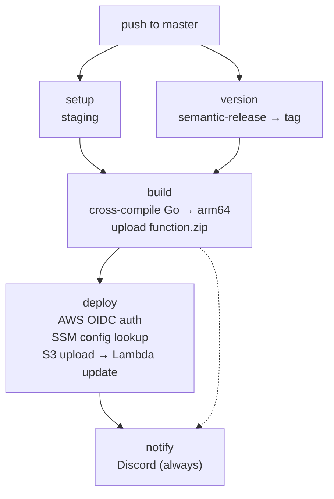
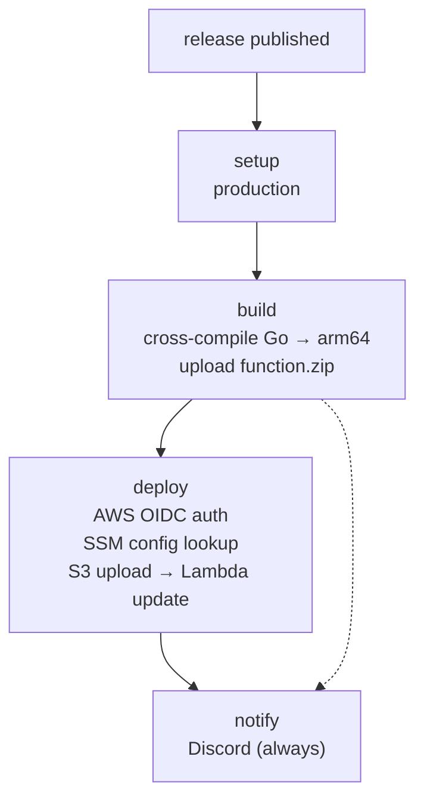

# Itala API

REST API backend for the [Itala](https://github.com/hyoaru/itala-pwa) personal finance platform. Built with Go and deployed as an AWS Lambda function behind API Gateway. Part of the Itala ecosystem alongside the [PWA frontend](https://github.com/hyoaru/itala-pwa), [workers](https://github.com/hyoaru/itala-workers), and [infrastructure](https://github.com/hyoaru/itala-infrastructure).

Manages accounts, categories, and transactions with single-table DynamoDB design, JWT authentication via Amazon Cognito, and idempotent writes for transaction operations.

## Architecture

The codebase follows clean architecture (hexagonal) with domain, application, and infrastructure layers. Each feature (account, category, transaction, identity) is isolated under `internal/features/` with its own domain entities, use cases, repository ports, and DynamoDB adapters. Decorator patterns provide cross-cutting concerns like logging, idempotency, and retry with exponential backoff.

A single DynamoDB table stores all entities using a composite key design (PK/SK) with GSIs for transaction queries by type, account, and category.

Development follows trunk-based development with `master` as the single long-lived branch. All work is committed directly to `master` or merged via short-lived PRs. [Semantic-release](https://github.com/semantic-release/semantic-release) automates versioning based on conventional commits. Pushing to `master` deploys to staging; publishing a GitHub release promotes to production.

### Platform Architecture


## Project Structure

```
itala-api/
├── cmd/
│   ├── api/main.go              # Local HTTP server (:8080)
│   └── lambda/main.go           # AWS Lambda entrypoint
├── docs/
│   ├── api/                    # Bruno API collection
│   └── assets/                 # Architecture diagrams
├── version/version.go           # Build version (injected via ldflags)
├── internal/
│   ├── app/api/
│   │   ├── app.go               # Bootstrap, dependency wiring
│   │   ├── router.go            # Chi router, all route registration
│   │   ├── middleware/           # Authentication middleware
│   │   ├── handler/             # HTTP handlers (account, category, transaction)
│   │   ├── request/             # JSON body + query string decoders
│   │   └── response/            # JSON response writers
│   ├── features/
│   │   ├── account/             # Account domain, use cases, DynamoDB adapter
│   │   ├── category/            # Category domain, use cases, DynamoDB adapter
│   │   ├── transaction/         # Transaction domain, use cases, DynamoDB adapter
│   │   └── identity/            # Cognito JWT validation, identity provider
│   └── shared/
│       ├── domain/valueobject/  # Decimal, TransactionType value objects
│       └── infrastructure/      # DynamoDB client, idempotency, logger
├── .env.example                 # Required environment variables template
├── Makefile                     # build, package targets
└── .air.toml                    # Hot-reload config
```

## Environment Variables

| Variable | Description |
|----------|-------------|
| `AWS_REGION` | AWS region for Cognito issuer URL |
| `COGNITO_USER_POOL_ID` | Cognito User Pool ID for JWT validation |
| `DYNAMODB_TABLE_NAME` | DynamoDB table name (single-table design) |

## Tech Stack

- **Go 1.26** — core language
- **Chi v5** — HTTP router
- **AWS SDK v2** — DynamoDB client
- **Cognito JWT** — authentication via JWKS (keyfunc + golang-jwt)
- **algnhsa** — Lambda-to-HTTP adapter
- **shopspring/decimal** — arbitrary-precision decimal arithmetic
- **Air** — hot-reload for local development

## Prerequisites

- Go 1.26+
- AWS credentials configured (default credential chain)
- A `.env` file (see [Environment Variables](#environment-variables))

## Deployment

### CI/CD Pipeline

Deployments are fully automated via GitHub Actions. All pipelines use OIDC-based AWS authentication (no static credentials), fetch configuration from SSM Parameter Store, and notify Discord on completion.

#### Staging — `release.yml`

Triggered on push to `master`. Runs semantic-release to determine the next version, builds the Lambda binary, and deploys to the staging environment.



#### Production — `publish.yml`

Triggered when a GitHub release is published. Builds from the release tag and deploys to the production environment.


